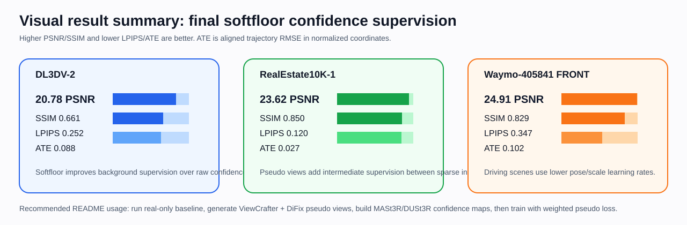
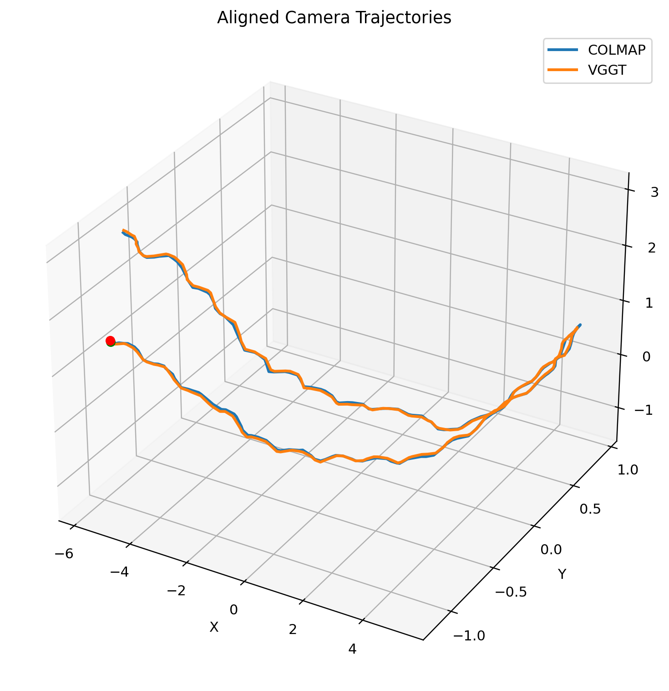

# AIAA3201 Generative Sparse-View 3D Reconstruction

This is the public code repository for our AIAA3201 computer-vision course project on **generative sparse-view, unposed 3D Gaussian reconstruction**. The final system extends InstantSplat with ViewCrafter/DiFix pseudo views and cross-view confidence weighting, while preserving real-view-only geometry initialization.

**Core idea.** Sparse real views are used to estimate camera poses and initialize the Gaussian scene. Generated pseudo views are used only as confidence-weighted photometric supervision; they do **not** initialize geometry and they do **not** trigger densification in the final setting.


## What Is Included

```text
AIAA3201_3DGS_Project/
  Part1_Scripts/                         # posed 3DGS / VGGT initialization studies
  third_party/
    gaussian-splatting/                  # original 3DGS baseline
    InstantSplat/                        # main codebase modified for this project
      run_eval_pipeline.py               # train/test pipeline wrapper
      init_geo.py                        # MASt3R/Dust3R geometry and split initialization
      train.py                           # pseudo-view confidence-weighted training
      scene/, arguments/, utils/          # dataset/camera/pipeline extensions
      tools/
        build_reconx_dust3r_confidence.py
        build_soft_confidence_masks.py
        build_pseudo_as_real_split.py
        filter_pseudo_manifest.py
        repair_test_poses_timeaware.py
        score_pseudo_temporal_consistency.py
      docs/
        VIEWCRAFTER_DIFIX_FUSED_ASREAL_PIPELINE.md
```

The repository intentionally does **not** include generated datasets, model checkpoints, experiment outputs, or third-party weight files.

## Dependencies

The main reconstruction code was run on Linux with CUDA GPUs. We used a Conda environment named `instantsplat`.

```bash
git clone --recursive https://github.com/hqiang335/AIAA3201_3DGS_Project.git
cd AIAA3201_3DGS_Project/third_party/InstantSplat

conda create -n instantsplat python=3.10.13 cmake=3.14.0 -y
conda activate instantsplat

# Pick the CUDA build matching your machine. This is the version family we used.
conda install pytorch torchvision pytorch-cuda=12.1 -c pytorch -c nvidia -y

pip install -r requirements.txt
pip install submodules/simple-knn
pip install submodules/diff-gaussian-rasterization
pip install submodules/fused-ssim

# Extra packages used by pseudo-view supervision / perceptual losses.
pip install lpips imageio imageio-ffmpeg

# Optional DiFix dependencies if you run DiFix enhancement on the same machine.
pip install -r tools/requirements_difix.txt
```

Optional CUDA acceleration for MASt3R/DUSt3R positional embeddings:

```bash
cd croco/models/curope
python setup.py build_ext --inplace
cd ../../../
```

## Required Weights

Create the following directories manually and download the weights:

```bash
cd AIAA3201_3DGS_Project/third_party/InstantSplat
mkdir -p mast3r/checkpoints
wget https://download.europe.naverlabs.com/ComputerVision/MASt3R/MASt3R_ViTLarge_BaseDecoder_512_catmlpdpt_metric.pth \
  -P mast3r/checkpoints/
```

Additional generative models used to make pseudo views:

| Component | Purpose | Weight / model identifier |
| --- | --- | --- |
| MASt3R / DUSt3R | pose, pointmap, confidence matching | `MASt3R_ViTLarge_BaseDecoder_512_catmlpdpt_metric.pth` |
| ViewCrafter | interpolation between adjacent sparse real views | use the official ViewCrafter checkpoints from its public repository |
| DiFix3D+ | pseudo-view restoration / sharpening | Hugging Face model id `nvidia/difix_ref` |
| LPIPS | perceptual pseudo-view loss | downloaded automatically by `lpips` |

Datasets and generated pseudo views are not committed. Keep them under a large-data directory such as `/root/autodl-fs`.

## Data Layout

Each real dataset should contain an `images` folder:

```text
/path/to/DL3DV-2/
  images/
    frame_00001.png
    frame_00036.png
    ...
```

Pseudo-view supervision uses a JSON manifest produced by the pseudo-view generation pipeline. Each pseudo entry points to a pseudo RGB image, an interpolated pose/time, and optionally a confidence mask. The training code loads this manifest through `--pseudo_manifest`.

## Run the Real-Only InstantSplat Baseline

This runs sparse unposed reconstruction with real views only:

```bash
cd AIAA3201_3DGS_Project/third_party/InstantSplat
conda activate instantsplat

python run_eval_pipeline.py \
  -s /path/to/DL3DV-2 \
  -m /path/to/outputs/DL3DV-2-10real-baseline-5k \
  --n_train 10 \
  --n_test 12 \
  -i 5000 \
  -r 1 \
  --scene_graph logwin-3-noncyclic \
  --max_init_points 0 \
  --point_conf_threshold 0 \
  --optim_test_pose_iter 500
```

Outputs are written under the model directory:

```text
model_path/
  pipeline.log
  results.json
  train/ours_5000/
  test/ours_5000/
  point_cloud/iteration_5000/
```

## Generate Pseudo Views

Our final experiments generate pseudo views between adjacent sparse real-view pairs:

1. select sparse real views;
2. for every adjacent pair, run ViewCrafter interpolation;
3. sample intermediate frames, e.g. 5 per real-view pair;
4. enhance pseudo RGBs with DiFix3D+;
5. build a pseudo manifest for InstantSplat training.

For the DL3DV-2 setting in the report:

| Setting | Value |
| --- | ---: |
| sparse real views | 10 |
| adjacent windows | 9 |
| sampled pseudo views per window | 5 |
| total pseudo views | 45 |
| training iterations | 5000 |

See the detailed operational note:

```text
third_party/InstantSplat/docs/VIEWCRAFTER_DIFIX_FUSED_ASREAL_PIPELINE.md
```

## Build MASt3R/DUSt3R Confidence Masks

After pseudo RGBs are generated and enhanced, build cross-view confidence maps:

```bash
python tools/build_reconx_dust3r_confidence.py \
  --pseudo_manifest /path/to/pseudo_manifest_fused_nomask_external.json \
  --source_images_dir /path/to/DL3DV-2/images \
  --output_dir /path/to/DL3DV-2-reconx-dust3r-confidence \
  --image_size 512 \
  --batch_size 1 \
  --bidirectional_pairs \
  --left_right_weight 1.0 \
  --neighbor_weight 0.75 \
  --all_pair_weight 0.5 \
  --aggregate weighted_mean \
  --mask_blur 1.0
```

This produces a new pseudo manifest whose entries include confidence masks. The final training remaps confidence `c` into a background-preserving soft weight:

```text
w = (0.25 + 0.75 c)^0.5
```

This down-weights unreliable generated regions while keeping low-texture backgrounds from disappearing entirely.

## Run the Final Method

Final setting: real views initialize geometry; pseudo views provide weighted supervision.

```bash
python run_eval_pipeline.py \
  -s /path/to/DL3DV-2 \
  -m /path/to/outputs/DL3DV-2-final-softfloor-5k \
  --n_train 10 \
  --n_test 12 \
  -i 5000 \
  -r 1 \
  --scene_graph logwin-3-noncyclic \
  --max_init_points 0 \
  --point_conf_threshold 0 \
  --optim_test_pose_iter 500 \
  --use_pseudo_views \
  --pseudo_manifest /path/to/pseudo_manifest_reconx_dust3r_confidence.json \
  --pseudo_start_iter 1 \
  --pseudo_ramp_until 1 \
  --pseudo_loss_weight 1.0 \
  --pseudo_sample_ratio 1.0 \
  --pseudo_pair_with_real \
  --pseudo_rgb_weight 0.8 \
  --pseudo_ssim_weight 0.2 \
  --pseudo_lpips_weight 0.5 \
  --pseudo_lpips_net vgg \
  --pseudo_confidence_floor 0.25 \
  --pseudo_mask_gamma 0.5
```

For Waymo-405841 FRONT we found lower pose/scale learning rates more stable:

```bash
python run_eval_pipeline.py \
  -s /path/to/405841/FRONT \
  -m /path/to/outputs/FRONT-final-softfloor-5k-lowlr-r4 \
  --n_train 20 \
  --n_test 12 \
  -i 5000 \
  -r 4 \
  --scene_graph logwin-3-noncyclic \
  --max_init_points 0 \
  --point_conf_threshold 0 \
  --optim_test_pose_iter 500 \
  --position_lr_init 0.000016 \
  --position_lr_final 0.00000016 \
  --scaling_lr 0.0005 \
  --use_pseudo_views \
  --pseudo_manifest /path/to/FRONT_pseudo_manifest_reconx_dust3r_confidence.json \
  --pseudo_start_iter 1 \
  --pseudo_ramp_until 1 \
  --pseudo_loss_weight 1.0 \
  --pseudo_sample_ratio 1.0 \
  --pseudo_pair_with_real \
  --pseudo_rgb_weight 0.8 \
  --pseudo_ssim_weight 0.2 \
  --pseudo_lpips_weight 0.5 \
  --pseudo_lpips_net vgg \
  --pseudo_confidence_floor 0.25 \
  --pseudo_mask_gamma 0.5
```

## Main Results

The numbers below are from the report tables for the final course datasets. ATE is aligned trajectory RMSE in the normalized reconstruction coordinate system.

| Method | DL3DV PSNR higher | DL3DV SSIM higher | DL3DV LPIPS lower | DL3DV ATE lower | Re10k PSNR higher | Re10k SSIM higher | Re10k LPIPS lower | Re10k ATE lower | Waymo PSNR higher | Waymo SSIM higher | Waymo LPIPS lower | Waymo ATE lower |
| --- | ---: | ---: | ---: | ---: | ---: | ---: | ---: | ---: | ---: | ---: | ---: | ---: |
| Ours, raw confidence | 20.63 | **0.666** | 0.279 | 0.087 | 23.70 | 0.849 | 0.120 | 0.027 | **25.17** | 0.799 | **0.230** | 0.102 |
| Ours, softfloor confidence | **20.78** | 0.661 | **0.252** | 0.088 | 23.62 | **0.850** | **0.120** | 0.027 | 24.91 | **0.829** | 0.347 | 0.102 |



We also keep a Part-1 visual diagnostic for initialization quality:



## Notes and Limitations

- Generated pseudo views can improve coverage, but they can also introduce inconsistent content. The final pipeline therefore uses them as weighted supervision rather than as geometry seeds.
- MASt3R/DUSt3R confidence naturally favors textured and nearby regions. The softfloor remap was added because raw confidence can under-supervise sky, distant buildings, and other low-texture backgrounds.
- The repository contains scripts for additional failed or exploratory directions, including pseudo-as-real training and densification variants. The recommended final path is the confidence-weighted pseudo-supervision command above.

## Citation / Acknowledgements

This project builds on InstantSplat, DUSt3R/MASt3R, 3D Gaussian Splatting, ViewCrafter, DiFix3D+, ReconX-style confidence-aware optimization, and BRPO-style bidirectional pseudo-view reasoning. Please cite the corresponding original papers and repositories when reusing this code.
